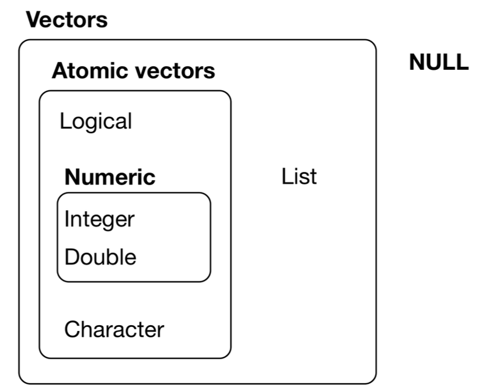

\newpage

# Atomic Types
{width=30% fig-align="center" fig-alt="Image showing nested relationships between R atomic types"}

R has five "atomic" types:

* logical (TRUE and FALSE)
* character ("character strings")
* integer
* double (double precision real numbers)
* complex (we won't use this)

\newpage

`integer`, `double,` and `complex` are all `numeric`.  

Values of the same type can be combined into atomic _vectors_.  

_Lists_ provide a way of combining different types of objects.  

Other classes of objects are built on these basic structures.

\newpage

```{r}
	3.14
	3.14e-4
	3.14e+4
	pi
	print(pi, digits = 16)    # Past this digits do not agree with the exact value of pi.
```

\newpage

[Floating point](https://floating-point-gui.de/formats/fp/) numbers and arithmetic are not exact.
```{r}
	print(3.14, digits = 20)
	.Machine$double.eps
```

\newpage

# Test Functions
```{r}
	is.numeric(pi)   # More on is.numeric later
	is.double(pi)    # Tests for atomic type double
	is.integer(pi)   # Tests for atomic type integer
	is.logical(pi)   # Tests for atomic type logical
	is.character(pi) # Tests for atomic type character
	typeof(pi)
	
	is.logical(is.character(pi)) # Why is this true? 
	is.character(is.logical(pi)) # Why is this false? 

	"pi"
	is.character("pi") 
	is.double("pi")
```

\newpage

```{r}
	5
	is.integer(5)
	is.double(5)
	
	5L
	is.integer(5L) 
	is.double(5L) 
```
```{r}
	.Machine$integer.max
```

\newpage

# Basic Arithmetic
```{r}
	2+3
	3-2*4
	(3 - 2) * 4
	3^2
	27^2/3
	27^(2/3)
	9L / 2L
	9 %/% 2    # Get integer part
	9%%2       # 9 mod 2 (remainder after integer division)
```

\newpage

# Basic Numerical Functions
**Absolute Value**

```{r}
	abs(1.2345)
	abs(-1.2345)
```

**Rounding**
```{r}
	round(1.2345)
	round(1.2345, digits = 3)
	round(-1.2345)
	floor(1.3)
	ceiling(1.3)
```

\newpage

**Exponential and Logarithm**
```{r}
	exp(1)
	exp(-2)
	log(exp(-2))
	log(8, base = 2)
	log(100, base = 10) 
	log10(100)
	log2(8)
```

\newpage

**Trigonometric Functions**
```{r}
	sin(pi/6)
	sin(30 * pi/180)  
	asin(0.5)
	asin(0.5) * 180/pi 
```

\newpage

**Many More**
```{r}
	gamma(5)
	gamma(1/2)
	sqrt(pi)
```

\newpage

**Combinatorics**
```{r}
	factorial(52)
	choose(52, 5)
	choose(52, 13)
	factorial(200)
	factorial(200) / (factorial(50) * factorial(150))
	lfactorial(200)
	exp(lfactorial(200) - lfactorial(50) - lfactorial(150)) 
	choose(200, 50)
	lchoose(200, 50)
```

\newpage

# Assignment Operator (Left Arrow)
```{r}
	x <- 10 # Assign ("bind") x to 10
	y <- x  # Bind y to whatever x is currently bound to.
	
	x + 1   # Print the value of x + 1
	x       # x is still bound to 10
	
	x <- x + 1   # Bind x to the value of x + 1 ("add 1 to x")
	x
	y       # y is still bound to 10
```
    
\newpage

```{r}
	x
	is.double(x)
	is.character(x) 
	
	y <- "x"
	y
	is.numeric(y) 
	is.character(y)
	
	get(y)      # Mind blown 
```
