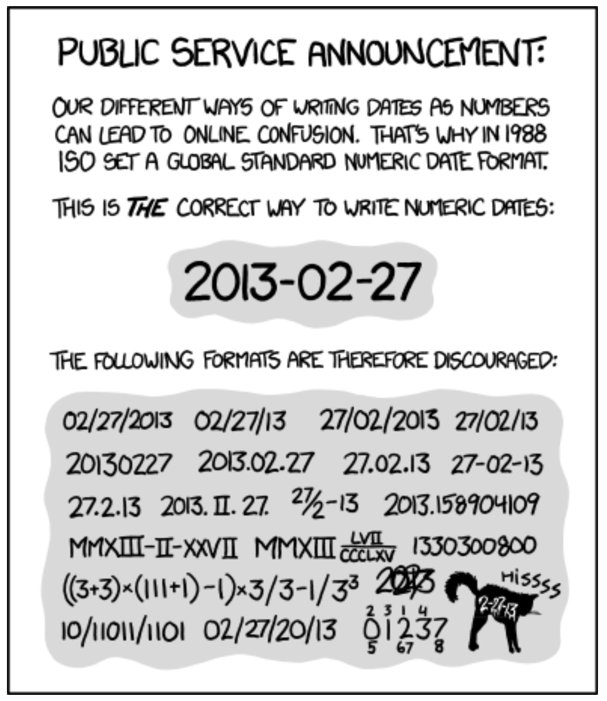
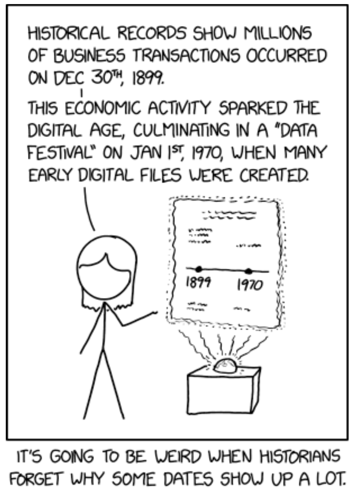
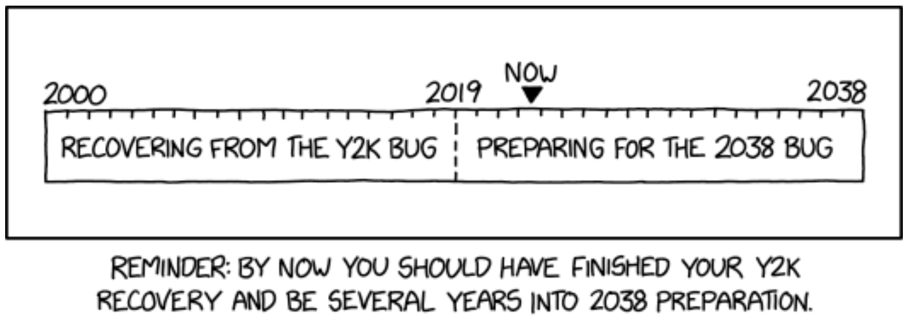

# Dates



```{r}
today <- Sys.Date()
today
```
Dates and Times are **Hard**:

* Different calendars
* Leap years 
* Time zones
* Daylight savings time
* Even [\textcolor{blue}{leap seconds}](https://en.wikipedia.org/wiki/Leap_second).

Read the R help for `as.Date`.

***

```{r}
  today
  attributes(today)
  typeof(today)       # Internal type/storage mode
  unclass(today)      # Removes class attribute
```

***

The value of the double represents the number of days _since_ 1970-01-01.

* 1970-01-01 = Unix day zero

```{r}
  day0 <- as.Date("1970-01-01")           # Converts character string to Date. 
  as.numeric(day0)                        # as.numeric() strips off attributes
  as.numeric(as.Date("1970-02-01"))
  as.numeric(as.Date("1959-02-03"))       # the day the music died
```

***


See Explain [\textcolor{blue}{XKCD: 2676: Historical Dates}](https://www.explainxkcd.com/wiki/index.php/2676:_Historical_Dates) and the examples section of `?as.Date`

* Many files and database entries contain a date, which, if not set, defaults to 0 in many OS’s and apps.
* Many operating system and apps store dates as Unix timestamps, so 0 becomes 1970-01-01.
* Excel is said to use 1900-01-01 as day 1 (Windows default), but this is complicated by Excel incorrectly treating 1900 as a leap year, so that 0
becomes 1899-12-30.

***

* Dates can be incremented:
```{r}
today + 7
```

* `ISOdate()` creates date-times from numeric year, month, and day.
  - Useful if year, month, day stored in separate numeric columns.
  - Can convert to date using `as.Date()`.
```{r}
ISOdate(2020:2022, 12, 31)        # Month and day are recycled here.
as.Date(ISOdate(2020:2022, 12, 31))
```

# Handling Other Date Formats in Base R
```{r}
as.Date("02/03/1959", format = "%m/%d/%Y")    # Bad
as.Date("1-28-86", format = "%m-%d-%y")       # Bad, awful, and terrible.
as.Date("9-11-01", format = "%m-%d-%y")       # Even worse?
```
See `?strptime` for more information about format strings.

## `?strptime`

`Details:`

    '%d' Day of the month as decimal number (01-31).

    '%y' Year without century (00-99).  On input, values 00 to 68 are  
          prefixed by 20 and 69 to 99 by 19 - that is the behaviour
          specified by the 2018 POSIX standard, but it does also say  
          'it is expected that in a future version the default century  
          inferred from a 2-digit year will change'.
          
    '%Y' Year with century.  Note that whereas there was no zero in the
          original Gregorian calendar, ISO 8601:2004 defines it to be
          valid (interpreted as 1BC): see
          <https://en.wikipedia.org/wiki/0_(year)>.  However, the
          standards also say that years before 1582 in its calendar
          should only be used with agreement of the parties involved.
          
          For input, only years '0:9999' are accepted.

# Date-Times
Base R provides two ways of storing date-time information, POSIXct, and POSIXlt.

* "POSIX" is short for Portable Operating System Interface 
* "ct" stands for calendar time
* "lt" for local time

POSIXct is simplest.
```{r}
now <- Sys.time()
now
```
    
***
```{r}
now
attributes(now)
typeof(now)
unclass(now)
```  

***
The numeric value is the number of seconds since 1970-01-01.
```{r}
time0 <- as.POSIXct("1970-01-01", tz = "UTC") # Convert character string to date-time. 
time0
as.numeric(time0)
```

That’s midnight in "[\textcolor{blue}{Coordinated Universal Time}](https://en.wikipedia.org/wiki/Coordinated_Universal_Time)" (successor to GMT).  
This is one second later:
```{r}
as.numeric(as.POSIXct("1970-01-01 00:00:01", tz = "UTC"))
```

***

```{r}
as.numeric(as.POSIXct("1970-01-01 00:01", tz = "UTC"))   # 1 minute later
as.numeric(as.POSIXct("1970-01-01 01:00", tz = "UTC"))   # 1 hour later
as.numeric(as.POSIXct("1970-01-01"))      # Midnight in my time zone
```

What’s your system’s time zone?

```{r}
Sys.timezone()
```
***

Times can be incremented too:
```{r}
now
now + 1
```

***



See:  

* [\textcolor{blue}{Explain XKCD: 2697: Y2K and 2038}](https://www.explainxkcd.com/wiki/index.php/2697:_Y2K_and_2038)
* [\textcolor{blue}{Year 2000 Problem}](https://en.wikipedia.org/wiki/Year_2000_problem)
* [\textcolor{blue}{Year 2038 Problem}](https://en.wikipedia.org/wiki/Year_2038_problem)
  - Many operating system and applications (R included) still use 32 bit integers.
  - $2^{31} −1=2,147,483,647$
```{r}
.Machine$integer.max
as.POSIXct(.Machine$integer.max,
           origin="1970-01-01",
           tz="UTC")
```

***

`?as.POSIXct` makes for interesting reading.    
Usage:
```{r, eval = FALSE}
as.POSIXct(x, tz = "", ...)
as.POSIXlt(x, tz = "", ...)

## S3 method for class 'character'
as.POSIXlt(x, tz = "", format,
           tryFormats = c("%Y-%m-%d %H:%M:%OS",
                          "%Y/%m/%d %H:%M:%OS",
                          "%Y-%m-%d %H:%M",
                          "%Y/%m/%d %H:%M",
                          "%Y-%m-%d",
                          "%Y/%m/%d"),
           optional = FALSE, ...)
```
* Similarly to `as.Date()`, can specify format to convert character string to POSIXct (date-time).

# `?strptime`

`Details:`

    ...
    
    '%H' Hours as decimal number (00-23).  As a special exception strings
          such as '24:00:00' are accepted for input, since ISO 8601
          allows these.
    ...      
    
    '%M' Minute as decimal number (00-59).
          
    ...
          
    Specific to R is '%OSn', which for output gives the seconds truncated
    to '0 <= n <= 6' decimal places (and if '%OS' is not followed by a
    digit, it uses the setting of 'getOption("digits.secs")', or if that is
    unset, 'n = 0').  Further, for 'strptime' '%OS' will input seconds
    including fractional seconds.  Note that '%S' does not read fractional
    parts on output.  
    
# Durations
Durations represent the amount of time between dates or date-times and are stored in `difftimes`.
```{r}
one_week <- as.difftime(1, units = "weeks")
one_week
typeof(one_week)
```

***
```{r}
attributes(one_week)
as.numeric(one_week)
one_week_days <- as.difftime(7, units = "days")
one_week_days
```

***    


```{r}
as.numeric(one_week_days)
one_week + one_week_days
today - as.Date("1986-01-28")
difftime(today, as.Date("1986-01-28"), units = "weeks")
```

***

`?difftime`  

Usage:  

      time1 - time2
      difftime(time1, time2, tz,
               units = c("auto", "secs", "mins", "hours",
                         "days", "weeks"))
      as.difftime(tim, format = "%X", units = "auto", tz = "UTC")
    
Note:

       Units such as ‘"months"’ are not possible as they are not of constant
       length.  To create intervals of months, quarters or years use
       ‘seq.Date’ or ‘seq.POSIXt’.
    
# Other Formats
```{r}
as.difftime("3:20", format = "%H:%M")
as.difftime("3:20", format = "%M:%S")
as.difftime("3:20", format = "%M:%S", units = "secs")
```    

# An Aside: `is.numeric()`
`?is.numeric`

\setlength{\leftskip}{0.6cm}  

‘is.numeric’ is an internal generic ‘primitive’ function: you can write methods to handle specific classes of objects, see InternalMethods. It is not the same as ‘is.double’. Factors are handled by the default method, and there are methods for classes ‘ “Date” ’, ‘ “POSIXt” ’ and ‘ “difftime” ’ (all of which return false). **Methods for ‘is.numeric’ should only return true if the base type of the class is ‘double’ or ‘integer’ and values can reasonably be regarded as numeric (e.g., arithmetic on them makes sense, and comparison should be done via the base type).**

\setlength{\leftskip}{0cm}

***


Thus `is.numeric(x)` returns true if and only if

* The base type of `x` is either `integer` or `double`
* **AND** arithmetic with objects like `x` (e.g., `x + y`) makes sense
* **AND** objects like `x` can be compared (`<, <=, ==, >=, >`) via their underlying `integer` or `double` values.

Dates are stored as `double`, but fail the 2nd test (`today + tomorrow = ???`):
```{r}
is.double(today)
is.numeric(today)
```

***
Same for date-times:
```{r}
is.double(now)
is.numeric(now)
```
***

Same for durations (why?):
```{r}
is.double(one_week)
is.numeric(one_week)
```