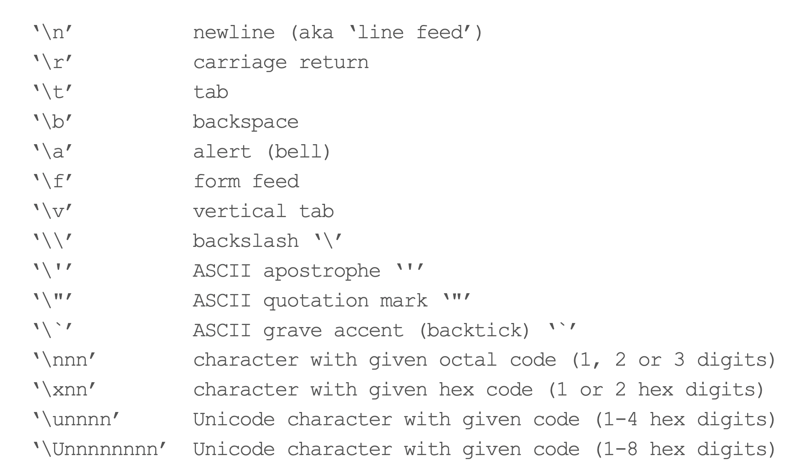

# String Basics

`?Quotes`

`Character constants`

`Single and double quotes delimit character constants. They can be used interchangeably but double quotes are preferred (and character constants are printed using double quotes), so single quotes are normally only used to delimit character constants containing double quotes.`

* So create strings with double or single quotes. Double quotes preferred.

```{r}
	string1 <- "Hello World!" 
	string1
```

* You can include literal single or double quotation marks in the string by quoting the entire string with the _other_ quote.

```{r}
	string2 <- 'I said, "Hello World!"' 
	string2
```

* Or make the quotes literal by _escaping_ them with the backslash character.

```{r}
	string2 <- "I said, \"Hello World!\"" 
	string2
```

* Note that the printed representation in the R console shows escapes and enclosing quotes.

* Use `writeLines()` to see the raw string.

```{r}
	writeLines(string2)
```

* If you want a literal backslash in your string, escape it with a backslash.

```{r}
	string3 <- "This string contains \\, a literal backslash character." 
	string3
	writeLines(string3)
```

**Complete list of special characters**

```{r}
#| echo: false
#| out-width: 15cm

	
```


<!-- ```{r, echo = FALSE, message=FALSE} -->
<!-- library(`tidyverse`) -->
<!-- library(knitr) -->
<!-- library(kableExtra) -->

<!-- table.tbl <- `tibble`( var1 = c("`\\n'", "`\\r'", "`\\t'", "`\\b'", "`\\a'", "`\\f'", "`\\v'", "`\\\\'", "`\\\''", "`\\\"'", "`\\\`'", "`\\nnn'", "`\\xnn'", "`\\unnnn'", "`\\Unnnnnnnn'"), -->
<!--                  var2 = c("newline (aka ‘line feed’)", "carriage return", "tab", "backspace", "alert (bell)", "form feed", "vertical tab", "backslash ‘\\’", "ASCII apostrophe ‘\'’", "ASCII quotation mark ‘\"’", "ASCII grave accent (backtick) ‘\`’", "character with given octal code (1, 2 or 3 digits)", "character with given hex code (1 or 2 hex digits)", "Unicode character with given code (1-4 hex digits)", "Unicode character with given code (1-8 hex digits)")) -->
<!-- table.tbl |>  -->
<!--   kable("latex",  -->
<!--         col.names = NULL, -->
<!--         booktabs = T, -->
<!--         bottomrule = '', -->
<!--         toprule = '', -->
<!--         midrule = '')  -->
<!-- ``` -->

* The quotation mark (`"`), apostrophe (`'`), backslash (`\`), newline (`\n`), and tab (`\t`) are the most common special characters in strings.

# Unicode

See [Wikipedia’s List of Unicode Characters](https://en.wikipedia.org/wiki/List_of_Unicode_characters) or the [Unicode 15.0 Character Charts](https://www.unicode.org/charts/)

* Greek, Arabic, Hebrew, and Chinese? 

```{r}
#| results: asis

	ltrs <- c("\U3B3\U3C1\U3AC\U3BC\U3BC\U3B1\U3C4\U3B1", "\U645\U644\U639", "\U27F7",
		"\U5EA\U5D5\U5D9\U5EA\U5D5\U5D0", "\U5B57\U6BCD")
	writeLines(paste(ltrs, collapse = " "))
	cat(paste(ltrs, collapse = " "))
```


* [Letterlike Symbols](https://en.wikipedia.org/wiki/List_of_Unicode_characters#Letterlike_Symbols) and [Playing Cards](https://en.wikipedia.org/wiki/List_of_Unicode_characters#Playing_Cards)

```{r}
	x <- c("\U2115 \U2282 \U2124 \U2282 \U211A \U2282 \U211D \U2282 \U2102",
		"\U1F0AA\U1F0AB\U1F0AC\U1F0AD\U1F0A1")
	x
```

# The `stringr` Package

* We will focus on the `stringr` package, included in `tidyverse` 
* The underlying `stringi` package provides additional functionality if needed. 
* The `stringx` package defines improved replacements for base-R string- manipulation functions and “fully supports Unicode standards.”
  
How `stringr` differs from base-R for string manipulation

1. All `stringr` functions start with `str_` prefix; base-R string functions have no consistent naming scheme.
2. In `stringr` functions, the `string` to be manipulated is always the first argument. This makes `stringr` easier to use in pipes and with `purrr::map()`.
3. Functions in `stringr` tend to do less, where many of the string processing functions in base-R have multiple purposes. `stringr` simplifies string operations by eliminating options that you don’t need most of the time.

# Simple String Functions

In these functions `x` represents a single character string or a character vector.

| Purpose                            | `stringr`                |Base-R                   |
|:-----------------------------------|:-----------------------|:------------------------|
|Length of a string                  |`str_length(x)`         |`nchar(x)`               |
|Combining strings                   |`str_c(...)`            |`paste(...), paste0(...)`|
|Extract substring by position       |`str_sub(x, start, end)`|`substr(x, start, stop)` |
|Convert case of string              |`str_to_lower(x)`       |`tolower(x)`             |
|                                    |`str_to_upper(x)`       |`toupper(x)`             |
|                                    |`str_to_title(x)`       |`tools::toTitleCase(x)`  |
|                                    |`str_to_sentence(x)`    |                         |
|Collapse/flatten a character vector |`str_flatten(x, "")`    |`paste(x, collapse = "")`|


# String Length
```{r}
	library("tidyverse")     # Or library("stringr") for just the stringr package
	x <- c("abc", "a.c", "a\\c", "a \\\n\tc") 
	writeLines(x)
	str_length(x)
```

# Combining / Concatenating Strings

```{r}
	people <- c("Newman", "Jerry")
	str_c("Hello", people, ".")    # "Hello" and "." are recycled to match length of people.
	str_c("Hello", people, ".", sep = " ")
	str_c("Hello ", people, ".")
	salut <- c("Hello", "Goodbye") ; people <- c("Newman", "Jerry")
	str_c(str_c(salut, people, sep = " "), ".")
```

If that’s hard to understand, you could use an intermediate result:

```{r}
	y <- str_c(salut, people, sep = " ") 
	y
	str_c(y, ".")
```

Or a pipe:
```{r}
	str_c(salut, people, sep = " ") |>
		str_c(".")
```


# Collapsing / Flattening
```{r}
	str_c(letters[24:26], collapse = " * ")   # Old way, same as base-R paste() function
	str_flatten(letters[24:26], " * ")                  # New way with str_flatten()
	str_c(c(7, 2, 6), letters[24:26], sep = "*", collapse = " + ")         # Old way
	str_c(c(7, 2, 6), letters[24:26], sep = "*") |>
		str_flatten(" + ")     # New way
	people <- c("Newman", "Jerry") 
	dialogue <- 
	str_c(rev(people), ": ", "Hello ", people, ".") |> 
		str_flatten("\n") 
	writeLines(dialogue)
```

# Substrings
```{r}
	state.name[1:5]
	str_sub(state.name, 4, 9)[1:5]
	str_sub(state.name, 4, -1)[1:5]
	table(str_sub(state.name, 1, 1))
	table(str_sub(state.name, -1, -1))
	x <- str_c(state.name, " (", state.abb, ")") 
	x[1:5]
	st.nm <- str_sub(x, 1, -6) 
	st.nm[1:5]
	st.ab <- str_sub(x, -3, -2) 
	st.ab[1:5]
	x[1:5]
	str_sub(x, -4, -4) <- "[" 
	str_sub(x, -1, -1) <- "]" 
	x[1:5]
```

* See the [from-base vignette](https://cran.r-project.org/web/packages/stringr/vignettes/from-base.html) (`vignette("from-base")`) for other useful `stringr` functions.
