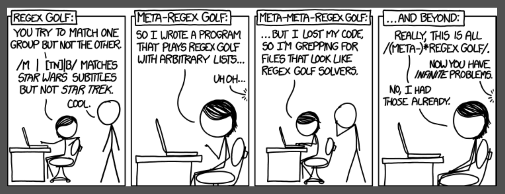
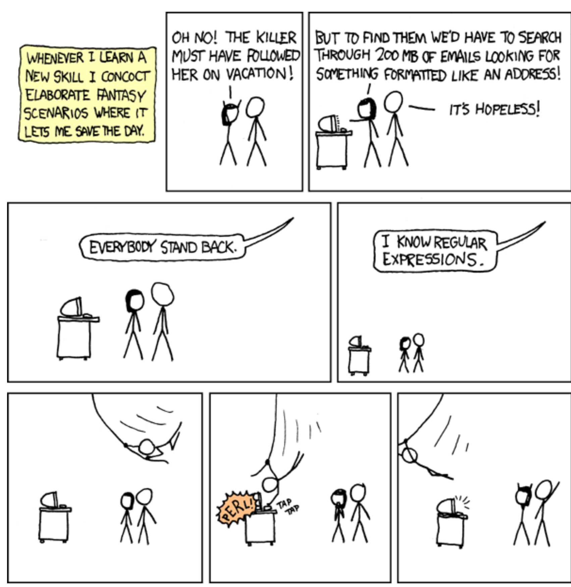

{width=100% fig-align="center" fig-alt="XKCD comic discussing regular expression golf."}

# Basic Matches

The function `str_view()` is used _only_ to display regex matches.

**Exact strings**

* The simplest kind of regular expression (regex or regexp) matching.
```{r}
	library(stringr)
	x <- c("apple", "banana", "pear") 
	str_view(x, "an")
```

***

**Arbitrary characters**

* A dot (.) matches any character except a newline.

```{r}
	x
	str_view(x, ".a.")
```


* Matches never overlap.

```{r}
	str_view("banana", ".a.")
	str_view("bananas", ".a.")
```

***

* So how do we match a literal period?
  - . is a special character in a regex.
  - In a regex we escape special characters with \\.
  - But we specify the regex with an R string, so we must escape the \\ too.
  
```{r}
	writeLines("\\.")
	str_view(c("abc", "a.c", "bef"), "a\\.c")
```  

* And if we want to match a literal backslash?
  - \\ is special in a regex and must be escaped, so we need 2 \\’s in the regex.
  - In the R string, must escape both \\’s, so we need 4 \\’s altogether.
```{r}
	x <- "a\\b" 
	writeLines(x)
	writeLines("\\\\")
	str_view(x, "\\\\")
```

The characters

```text
. + * ? ^ $ () [] {} | \
```

all have special meaning in a regex, so for a literal match they must be escaped.

# Position Anchors

* `^` (caret) matches start of string
* `$` (dollar) matches end of string

```{r}
	x <- c("apple", "banana", "pear") 
	str_view(x, "^a")
	str_view(x, "a$")
	x <- c("apple pie", "apple", "red apple") 
	str_view(x, "apple")
	str_view(x, "^apple$")
```

***

Other position anchors:

* `\b` : word boundary, i.e., start-of-word or end-of-word.
* `\B` : Non-start-of-word or non-end-of-word.

```{r}
	str_view("Even a toucan can.", "\\bcan\\b")
	str_view("Even a toucan can.", "can\\b")
```

# Character Classes

* `[aeiou]` : matches a, e, i, o, or u
* `[^aeiou]` : matches anything except a, e, i, o, or u
* `[r-z]` : match any letter from r through z


```{r}
	str_view(c("abc", "ab3", "a23"), "[0-9]")
	str_view(c("123", "1-c", "1b-"), "[^0-9]")
	str_view(c("Bob", "Carol", "Ted", "Alice"), "^[A-M][n-z]")
```

* **Q**: Is the regex `^[A-M][^a-m]` the same as `^[A-M][n-z]`?

Note

* For negation `^` must appear immediately after `[`, i.e., `[^...]`, not `[ ^...]`.
* The meaning of `^` changes from “start of string” outside `[]` to “not” inside `[]`.
* Similarly the `-` character plays a special role inside `[]` and `\` is still used as escape and for special characters and metacharacters.
* _Only_ these four characters require escaping inside the bracket list: `^` `-` `\` `]`
  - Why the last one?
  - This means `.` `+` `*` `?` `$` `(` `)` `[` `{` `}` `|`represent themselves inside `[]`.


```{r}
	str_view("abc.45", ".[.].")       # Same as str_view("abc.45", ".\\..")
```

There are also predefined classes that can be used inside `[]` such as
```text
[:alnum:]
[:alpha:]
[:digit:]
[:blank:]
[:space:]
[:punct:]
```
and others (see the help for `regex` and/or the [regular-expressions vignette](https://cran.r-project.org/web/packages/stringr/vignettes/regular-expressions.html) for a complete list).

# Metacharacters

* `.` : (dot) matches any character except newline (same as `[^\n]`)

* `\d` : matches any digit (same as `[0-9]`)
* `\D` : matches any nondigit character (same as `[^0-9]`)

* `\s` : matches any whitespace character (for ASCII same as `[ \n\r\t\f]`)
* `\S` : matches any non-space character

* `\w` : matches any “word” character (for ASCII same as `[a-zA-Z0-9]`)
* `\W` : matches any non-word character


```{r}
	str_view(c("1 to 100", "can't"), "\\d\\d")
	str_view(c("1 to 100", "can't"), "\\W")   # So blank is not actually a word character.
	str_view(c("a  b \tc", "a b\tc", "a \\\n\tb"), "\\s\\s")
```

# Alternatives (Or)

* `a|b` matches `a` or `b`

Use parenthesis with multiple characters and to group.

```{r}
#| warning: false

	str_view_all('Is it "summarise" or "summarize"?', "summari(s|z)e")
	str_view(c("He has 8 guitars?", "He has eight guitars?"), "(eight|8)")
	str_view("I think he has four banjos.", "(three|3|four|4)\\s(guitars|banjos)")
```

# Repetition

* `?` : 0 or 1 occurrences

* `*` : 0 or more
* `+` : 1 or more

* `{m,n}` : m to n times (both inclusive) 
* `{m}` : exactly m times
* `{m,}` : m or more times

```{r}
	str_view(c("I", "II", "III"), "II?")
	str_view(c("I", "II", "III", "IIII", "IIIII", "IIIII", "IIIIII"), "I{2,3}")
	str_view(c("I", "II", "III", "IIII"), "II+")
	str_view(c("I", "II", "III", "IIII"), "II*")            # Same as "I+"
```

* By default the repeaters are “greedy” and match the longest string possible.
* Advanced technigue: can make the repeaters “lazy ” by adding a `?`.

```{r}
	str_view(c("I", "II", "III"), "II+?")
	str_view(c("I", "II", "III"), "II*?")
```

***

**Example: Random phone numbers**

[Format](https://en.wikipedia.org/wiki/North_American_Numbering_Plan#Modern_plan): `NXX` `NXX-XXXX` where N is any digit 2-9 and X is any digit 0-9.

```{r}
	rphone <- function(area_code = NULL, exchange = NULL, station = NULL) { 
		## Generate random area code and exhange unless otherwise specified. 
		if (is.null(area_code)) area_code <- sample(200:999, 1)
		if (is.null(exchange)) exchange <- sample(200:999, 1)
		## Have to allow for leading zeros with station code.
		if (is.null(station)) {
		station <- sample(0:9, 4, replace = TRUE) 
		station <- paste0(station, collapse = "")
		}
		## Paste them together and return the string.
		paste0(area_code, " ", exchange, "-", station) 
		}

	bob_and_carol <- rphone()
	ted_and_alice <- rphone(area_code = str_sub(bob_and_carol, 1, 3))

	#PH <- "[2-9][0-9]{2} [2-9][0-9]{2}-[0-9]{4}"

	country_re <- "(\\+[0-9]+\\W{1,3})?"
	area_re<- "([2-9][0-9]{2}\\W{1,3})?"
	exchange_station_re<- "[2-9][0-9]{2}\\W{0,3}[0-9]{4}"

	str_view(c(bob_and_carol, ted_and_alice), str_c(country_re, area_re, exchange_station_re))

	str_sub(bob_and_carol, 5, 5) <- 1     # Changing first digit of exchange code to 1.
	ted_and_alice <- str_c("+101 ", ted_and_alice)    # Adding international code for U.S.A.
	str_sub(ted_and_alice, 5, 5) <- " ("
	str_sub(ted_and_alice, 10, 10) <- ") "
	bob_and_carol

	str_view(c(bob_and_carol, ted_and_alice), PH)
```

# Back References

Parentheses group/disambiguate **and** they create _back-references_.

* Back references are especially powerful when replacing text.
* Referred to sequentially as `\1`, `\2`, etc

```{r}
	str_view(fruit, "(..)\\1")
	str_view(fruit, "([aeiou]).\\1.\\1")
	str_view(fruit, "([aeiou]).([aeiou]).(\\1|\\2)")
	str_view(fruit, "([aeiou]).*\\1.*\\1")
```

{width=100% fig-align="center" fig-alt="XKCD comic discussing saving the day with regular expressions."}

# String Functions Using Regular Expressions

In general `pattern` and `replacement` will be regular expressions.

| Purpose                            | `stringr`                                  |Base-R                                |
|:-----------------------------------|:-----------------------------------------|:-------------------------------------|
|View regex match                    |`str_view(x, pattern)`                    |                                      |
|Find positions matching pattern     |`str_which(x, pattern)`                   |`grep(pattern, x)`                    |
|Detect presence/absence of pattern  |`str_detect(x, pattern)`                  |`grepl(pattern, x)`                   |
|Keep strings matching pattern       |`str_subset(x, pattern)`                  |`grep(pattern, x, value = TRUE)`      |
|Count number of matches             |`str_count(x, pattern)`                   |`sapply(gregexpr(pattern, x), length)`|
|Extract matching patterns           |`str_extract(x, pattern)`                 |`regexpr(pattern, x) + regmatches()`  |
|                                    |`str_extract_all(x, pattern)`             |                                      |
|Extract matched components          |`str_match(x, pattern)`                   |`regexpr(pattern, x) + regmatches()`  |
|                                    |`str_match_all(x, pattern)`               |                                      |
|Replace matched patterns            |`str_replace(x, pattern, replacement)`    |`sub(pattern, replacement, x)`        |
|                                    |`str_replace_all(x, pattern, replacement)`|`gsub(pattern, replacement, x)`       |
|Split string into pieces            |`str_split(x, pattern)`                   |`strsplit(x, pattern)`                |
|                                    |`str_split_fixed()`                       |                                      |

# Detect Matches

```{r}
#| message: false

	library("tidyverse")     # Or library("stringr") for just the stringr package
	str_detect(c("Bob", "Carol", "Ted", "Alice"), "A|a")    # Contain "A" (or "a") or not?
```

And the negation:

```{r}
	!str_detect(c("Bob", "Carol", "Ted", "Alice"), "A|a")
	str_detect(c("Bob", "Carol", "Ted", "Alice"), "A|a", negate = TRUE)
```

<!-- * **Q**: When might we want to use `negate = TRUE` instead of `!` ? -->

```{r}
	sum(str_detect(words, "e$"))     # Number of stringr::words ending in "e".
	mean(str_detect(words, "e$"))    # Proportion of stringr::words ending in "e".
```

***

* `str_detect()` could be used in a filter to select rows of data frame based on the entries in a column of character strings.

```{r}
	guitars <- read_csv("guitars.csv", show_col_types = FALSE)
	guitars |>
		filter(str_detect(Model, "[0-9]"))   # Only rows with a digit in Model
	sum(str_detect(words, "z"))                     # How many contain "z"?
	## Which ones contain "z"?
	str_which(words, "z")                           # Same as which(str_detect(words, "z"))
	## Return the words containing "z".
	str_subset(words, "z")                          # Same as words[str_detect(words, "z")]
```

***

ESPN’s abbreviations for NBA teams

```{r}
	nba.abb <- c("ATL", "BOS", "BKN", "CHA", "CHI", "CLE", "DAL", "DEN", "DET", "GS", 
		"HOU", "IND", "LAC", "LAL", "MEM", "MIA", "MIL", "MIN", "NO", "NY", 
		"OKC", "ORL", "PHI", "PHX", "POR", "SAC", "SA", "TOR", "UTAH", "WSH")
	str_subset(nba.abb, "[AEIOU]", negate = TRUE)          # Which do not contain a vowel?
```

This is probably easier to understand than:
```{r}
	str_subset(nba.abb, "^[^AEIOU]*$")
```

# Counting Matches

* `str_count()` counts the number of matches in a string.
* Remember, matches never overlap.

```{r}
	str_count(c("banana", "papaya", "pomegranate"), ".a.")
	str_count(c("bananas", "papayas", "pomegranates"), ".a.")
	mean(str_count(words, "[aeiou]")) # Average number of vowels (lower case) per word.
	df <- tibble(word = words) |>
		mutate(vowels = str_count(word, "[AEIOUaeiou]"),
		consonants = str_count(word, "[^AEIOUaeiou]")) 
	df |>
		slice_sample(n = 6, replace = TRUE) |>
			arrange(word)
```

# Extract Matches

```{r}
	head(sentences)
```

* Let’s find all the sentences that contain a fruit.
* We have a character vector of 80 fruit names.

```{r}
	length(fruit)
```

* First construct the “pattern” (regex).

```{r}
	fruit_pattern <- str_c(fruit, collapse = "|")
	str_sub(fruit_pattern, 1, 70) # Show the 1st 70 characters of the pattern.
```

* Get the matching sentences.

```{r}
	fruit_sentences <- str_subset(sentences, fruit_pattern)
```

* Extract the actual matched strings.

```{r}
	matches <- str_extract(fruit_sentences, fruit_pattern) 
	matches
```

What if a sentence started with a Fruit?

* We have missed any sentence where the fruit was capitalized.
* Could convert sentences and fruits to lower case with `tolower()`.
* BETTER: use the `stringr` helper function `regex()` with `ignore_case = TRUE`.

```{r}
	fruit_sentences <- str_subset(sentences, regex(fruit_pattern, ignore_case = TRUE)) 
	matches <- str_extract(fruit_sentences, regex(fruit_pattern, ignore_case = TRUE)) 
	matches
	str_subset(sentences, "Grape")
```

* Read [Section 16.5 of r4ds2e](https://r4ds.hadley.nz/regexps.html#pattern-control) for more `regex()` options.

***

What else might have gone wrong?

* Maybe check fruit for anything other than letters, numbers, and blanks?

```{r}
	str_detect(fruit, "[^a-zA-Z0-9 ]") |>
		any()    # Looks like we're ok here.
```

***

* What about this?

```{r}
	str_extract(c("fight", "pearl"), regex(fruit_pattern, ignore_case = TRUE))
```

* “Figure” and “pearl” are not fruits. What should we do?

Repairing our regex

* Use parenthesis around the big “or” we already have.
* Add an optional `s` at the end for plurals.
* Surround with word boundaries.

```{r}
	fruit_pattern_old <- fruit_pattern
	fruit_pattern <- str_c("\\b(", fruit_pattern, ")s?\\b") 
	str_sub(fruit_pattern, 1, 50) # Start of the regex
	str_sub(fruit_pattern, -50, -1) # End of the regex
	fruit_sentences <- str_subset(sentences, regex(fruit_pattern, ignore_case = TRUE))
	matches <- str_extract(fruit_sentences, regex(fruit_pattern, ignore_case = TRUE)) 
	matches
```

* Let’s look at a sample of the matching sentences.

```{r}
	sample(fruit_sentences, 5)
```

* In this example there are only (12) matches, so we can look at all of them.

```{r}
	fruit_sentences
```

* We’ve done a pretty good job with our list of fruits, but ...
  - Not all plurals are formed by adding an s (“cherries”).
  - Some fruits are used as color names (“orange red”).

***

* Let’s go back and see the sentences we eliminated by improving our regex.

```{r}
	has_fruit <- str_detect(sentences, regex(fruit_pattern, ignore_case = TRUE)) 
	has_fruit_old <- str_detect(sentences, regex(fruit_pattern_old, ignore_case = TRUE)) 
	any(has_fruit & !has_fruit_old)           # Was anything added? No.
	sentences[!has_fruit & has_fruit_old]     # What sentences were eliminated?
```

* What was being incorrectly matched?
* Or could have been incorrectly matched?

```{r}
	sentences[has_fruit_old & !has_fruit] |> 
		str_view(regex(fruit_pattern_old, ignore_case = TRUE))
```

***

Did any sentences contain more than one fruit?

```{r}
	has_multiple_fruits <- 
	(str_count(sentences, regex(fruit_pattern, ignore_case = TRUE)) > 1)
	sum(has_multiple_fruits) # Just 1.

	## Let's get it.
	multi_fruit_sentences <- sentences[has_multiple_fruits] 
	multi_fruit_sentences
```

* To extract all the matches, use `str_extract_all()`.

```{r}
	str_extract_all(multi_fruit_sentences, regex(fruit_pattern, ignore_case = TRUE))
```

* Unlike `str_extract()`, the function `str_extract_all()` returns a list.
  - Because strings in a character vector can have differing numbers of matches.
  
```{r}
	str_extract_all(fruit_sentences, regex(fruit_pattern, ignore_case = TRUE))[1:6]
```

* Setting `simplify = TRUE` returns a matrix instead of a list.

```{r}
	str_extract_all(fruit_sentences, regex(fruit_pattern, ignore_case = TRUE), 
		simplify = TRUE)
```

# Grouped Matches

Groups defined by parentheses in the regular expression.

```{r}
	noun <- "(a|the) ([^ ]+)"
	## noun <- regex("\\b(a|the) ([^ ]+)\\b", ignore_case = TRUE) # Would be better.
	sentences_with_noun <- sentences |> 
		str_subset(noun) |>
			head(10)
```

* `str_extract()` gives just the matches.

```{r}
	sentences_with_noun |> 
		str_extract(noun)
```

* `str_match()` also gives the components of the match

```{r}
	sentences_with_noun |> 
		str_match(noun)
```

*** 

```{r}
#| echo: false

	rphone <- function(area_code = NULL, exchange = NULL, station = NULL) { 
		## Generate random area code and exhange unless otherwise specified. 
		if (is.null(area_code)) area_code <- sample(200:999, 1)
		if (is.null(exchange)) exchange <- sample(200:999, 1)
		## Have to allow for leading zeros with station code.
		if (is.null(station)) {
		station <- sample(0:9, 4, replace = TRUE) 
		station <- paste0(station, collapse = "")
		}
		## Paste them together and return the string.
		paste0(area_code, " ", exchange, "-", station) 
		}

	```{r}
	bob_and_carol <- rphone()
	ted_and_alice <- rphone(area_code = str_sub(bob_and_carol, 1, 3)) 
	dialogue <- c(
		str_c("Ted: Their number is ", bob_and_carol, "."),
		str_c("Carol: Just dial ", ted_and_alice, " and ask for Alice.")) 
	dialogue

	PH <- "([2-9][0-9]{2}) ([2-9][0-9]{2})-([0-9]{4})" 
	str_match(dialogue, PH)
```

* `str_match_all()` returns a list of matrices with rows giving all matches.

```{r}
	dialogue <- c(dialogue, 
		str_c("Horst: Bob and Carol's number is ", bob_and_carol, ";",
		"Ted and Alice's is ", ted_and_alice, ".")) 
	str_match_all(dialogue, PH)
```

# Replacing Matches

* `str_replace()` and `str_replace_all()` replace matches with new strings.

```{r}
	str_replace(fruit, "[aeiou]", "-")[1:5]
	str_replace_all(fruit, "[aeiou]", "-")[1:5]
```

*** 

* Especially useful with back-references.
```{r}
	contacts <-
	tibble(name = c("Liam", "Olivia", "Noah", "Emma", "Oliver", "Charlotte"),
		number = replicate(6, rphone()))
	contacts
```

```{r}
	PH <- "([2-9][0-9]{2}) ([2-9][0-9]{2})-([0-9]{4})" 
	contacts |> 
		mutate(new_number = str_replace(number, PH, "(\\1) \\2 \\3"))
```

# Splitting

```{r}
	sentences |> 
		head(4) |> 
			str_split(" ")
```

* `str_split()` returns a list because each element of a character vector might contain a different number of pieces.
* Setting `simplify = TRUE` returns a matrix instead.

```{r}
	sentences |> 
		head(4) |> 
			str_split(" ", simplify = TRUE)
```

***

* Optional argument `n` give maximum number of splits.

```{r}
	sentences |> 
		head(4) |> 
			str_split(" ", n = 3, simplify = TRUE)
```

*** 

* Can also split by character, line, sentence, or word boundaries.

```{r}
	x <- "This is a sentence. This is another sentence." 
	str_split(x, " ")
	str_split(x, boundary("word"))
	str_split(x, boundary("sentence"))
```

* To split into indvidual characters, either use empty string `""` or `boundary(character)`.

```{r}
	words |>
		sample(size = 3) |>
			str_split("")
```

* The tidyverse package `purrr` provides the function `flatten_chr()`, which we can use to convert the list of character vectors returned by `str_split()` into a single _long_ character vector.

```{r}
	words |> 
		str_to_lower() |> 
			str_split("") |> 
				flatten_chr() |> 
					table() |> 
						sort()
```
